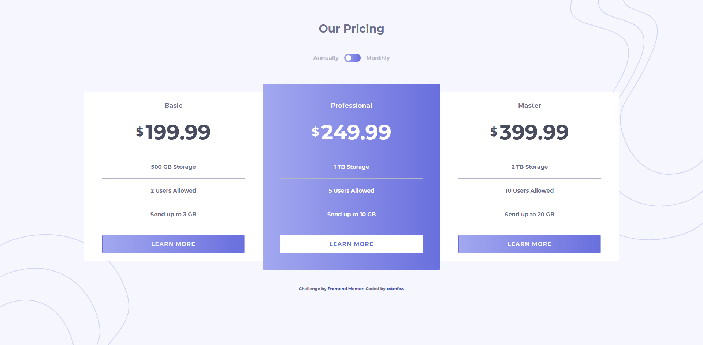

# Pricing Component

This is my personal solution for the pricing-component challenge by Frontend Mentor.

See the live version [here](https://pricing-component.sshimabuku.now.sh/ 'pricing-component')

### Note

This project was made with HTML and CSS only since I wanted to accomplish the bonus as well.

> Bonus: Complete the challenge with just HTML and CSS

## Interactions

- Click on the switch to toggle between annual and monthly prices

## Results

|             Mobile version             |             Desktop version             |
| :------------------------------------: | :-------------------------------------: |
|  |  |

## See also

[Link to the challenge](https://www.frontendmentor.io/challenges/pricing-component-with-toggle-8vPwRMIC)
